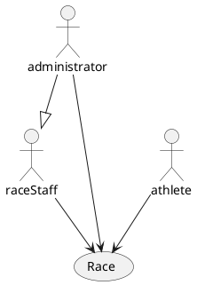
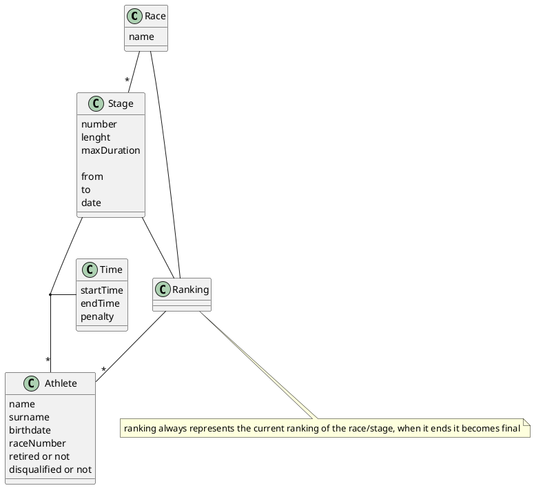

# notes
Race () collegata a stage e ranking
Stage (number, length, maximum duration) collegato a ranking
Time between stage and athlete (startTime, endTime, penalty)
Athlete(name, surname, birthdate, race number, retired or not, disqualified or not)
Ranking

# context diagram

# interfaces

| actor         | physical             | logical |
| ------------- | -------------------- | ------- |
| raceStaff     | Client PC/Smartphone | GUI     |
| administrator | Client PC/Smartphone | GUI     |
| athlete       | Client PC/Smartphone | GUI     |

# glossary

# characterizations of sw process
Document-based or not, Number and duration of iterations, sequential/parallel activities, time framed or not, new development/maintenance

# validation of functional requirements
Prototyping, inspection, get feedback from end user representative, use gui prototypes, acceptance test cases

# check in and check out operations ??

# pair programming
2 programmers work together on the same code, one writes while the other checks if everything is correct and think about possible improvements, then after 1 hour they switch places.

# development: 6 months, 3 people. operation+maintenance: 12 years.
effort during development: 18person-months
effort during maintenance, assuming 1 person part-time: 6person-months*12years=72person-months

if maintenance>18person-months (18/12years=1.5person-months per year) then it will cost more!