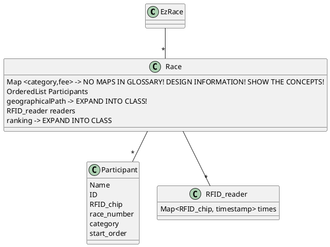

# Glossary

```plantuml
@startuml

class EzRace{
    
}

class Participant{
    Name
    ID
    RFID_chip
    race_number
    category
    start_order
}

class Race{
    Map <category,fee> -> NO MAPS IN GLOSSARY! DESIGN INFORMATION! SHOW THE CONCEPTS!
    OrderedList Participants
    geographicalPath -> EXPAND INTO CLASS!
    RFID_reader readers
    ranking -> EXPAND INTO CLASS
}

class RFID_reader{
    Map<RFID_chip, timestamp> times
}

EzRace--"*"Race
Race--"*"Participant
Race--"*"RFID_reader

@enduml
```
