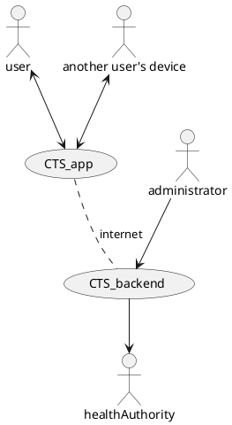
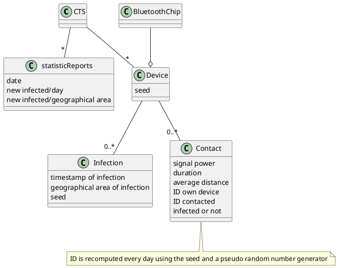
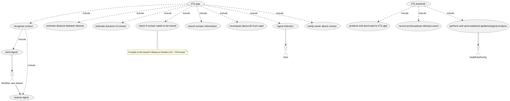
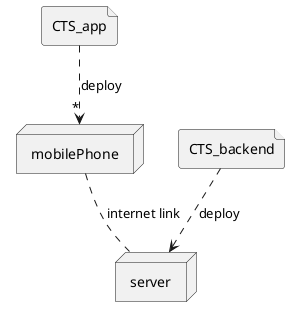

# notes
Contact Tracing System CTS

# context diagram

# interfaces
| actor                 | physical interface | logical interface                     |
| --------------------- | ------------------ | ------------------------------------- |
| user                  | smartphone         | GUI                                   |
| administrator         | screen keyboard PC | GUI                                   |
| Another user's device | Bluetooth          | Exposure notification system protocol |

# glossary

# uc diagram

# deployment diagram

beello il loro!

# exhausting testing
Try all possible inputs. Almost never feasible except for very simple functions.

# reuse of external components impact
After the choice of the external component to choose, requirements and design must be modified so that the functionalities reflect those made available by the external components. It could be possible to remove some functionalities if they are not provided by the external component, to have a better tradeoff between cost and functionality. In design use wrappers and adapter design pattern.

# maintenance process changes
corrective (fix defects), perfective (change existing functions, charateristics), evolutive (add new features)
