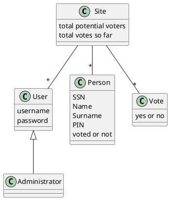
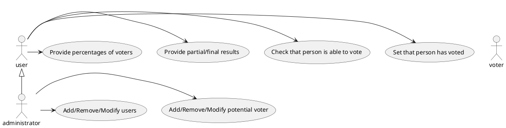

# functional requirement
check if person has right to vote and has not voted yet
# non functional requirement
time to perform check < 1second
# class diagram

# UC diagram

# Scenario
Preconditions:
- User exists and it's logged in.
Postconditions:
- Total voting count updated
- Person has voted
| Step | Description                               |
| ---- | ----------------------------------------- |
| 1.   | Person presents SSN and PIN               |
| 2.   | User checks if person is eligible to vote |
| 3.   | If check is positive, Person votes        |

# Configurations
- Italian Version (txt description, cover italian)
    - Short version (2 tracks)
    - Long version (6 tracks)
- English Version (txt description, cover english)
    - Short version
    - Long version

 English version short: madeof txt file in English, jpg cover in English, two musical files

 Italian version long: madeof txt file in italian, jpg cover in italian, six musical files 

# Inspection process activities
Select inspection team
schedule meeting
each member of the tema must read the product to ispect (document/code).
meeting with inspection team, moderator, author of document
everybody express their doubts, author answers questions
goal is only to find defects, not solve them
goal is not to punish author, but it shouldn't be too formal
write inspection results (adding issues to solve)

# Define fault and failure, underlining difference
Fault: Defect in a product (document or code).
Failure: Malfunctioning of the final product, found by the end user. This often corresponds to an unexpected result, not in line with the expectations of the end user.
Each failure is caused by a fault. If a fault is found and solved before release, it never becomes a failure. Otherways, it could generate 1 or more failure. It is also possible that a fault is present, but no one ever finds it, so it never generates a failure.

# Difference between testing and debugging
Testing is the process of executing the code with an oracle to compare actual results with expected results. If one of the results is different from the expected one, debugging is needed to investigate the code (and documents) and find the defect that caused this mismatch.

# Sofware reliability
Ability of the system to keep working as expected for the longest possible time. For websites a typical unit of measure is the number of "9s" that represents the uptime of the website (99.999% is called "five nines")
