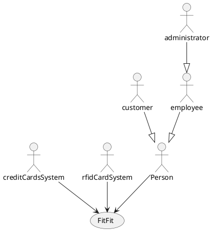
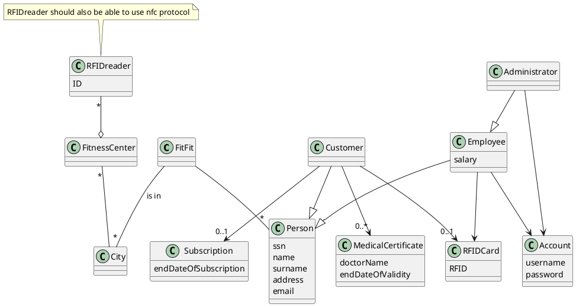
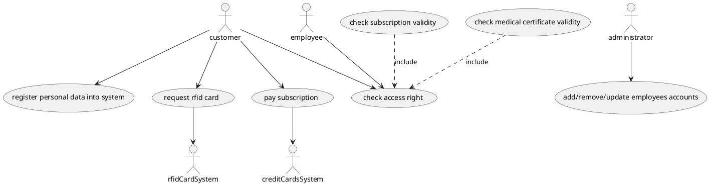
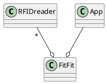

# context diagram

# interfaces

| actor             | physical interface                | logical interface                                       |
| ----------------- | --------------------------------- | ------------------------------------------------------- |
| customer          | PC or smartphone rfid card/nfc | GUI                                                     |
| employee          | PC or smartphone rfid card/nfc | GUI                                                     |
| administrator     | PC or smartphone                  | GUI                                                     |
| creditCardsSystem | internet link                     | credit card system API                                  |
| rfidCardSystem    | internet link                     | rfid card system API to request/cancel card generations |

# glossary

# UC diagram

# NFR
- Usability: customer should be able to insert personal data, upload medical certificate and pay subscription without training, in less than 10 minutes
- Reliability: website should be up and running 99% of the time
- Efficiency: website function should finish execution in less than 1s
- Efficiency: rfidReader should recognize rfidCard in less than 1s
- Security: employees should only be able to access to their account

# Scenario
Preconditions:
- Customer is registered in the system
- Customer has an active subscription
- Customer has a valid MedicalCertificate
- Customer has rfid card or nfc enabled smartphone

| Step | Description                                                        |
| ---- | ------------------------------------------------------------------ |
| 1    | Customer passes rfid card or nfc enabled smartphone on rfid reader |
| 2    | rfid reader identifies Customer in the system                      |
| 3    | check to verify subscription and medical certificate               |
| 4    | client passes checks and can access the facility                   |

# System design

# 3. White Box
già fatto

# 4. Scrum key concepts
Pair-programming is useful to share knowledge and increase quality immediately.
Test-driven-development is helpful to get end user's feedback earlier in the process.
Documents are not mandatory, especially the requirement document could just consist in a single page with the goal of the application, easier to understand.

# 5. How to select between different designs for the same FR?
If FRs are the same, non functional requirements helps decide between the different designs.

# 6. Configuration management copy modify merge approach and its pros and cons?
This is the default approach for configuration management and simplifies parallel development on different branch for the different types of functionalities (main branch, development branch, hotfix branch..). It is not so useful for project of only 1 person.

# 7. Exhaustive testing?
This would mean to try all possible input values of a program and checking all outputs. This is unfeasible for any reasonable application because the inputs possibilities are almost endless and it would take too much time to write all tests and expected outputs.

# 8. Mutation testing and its goals?
This implies inserting a random mutation in the code (as removing a statement, changing an arithmetic operation), and see if the test written until now catch the mutation. It is a different approach to testing that could help find more defects. Not all mutations can be detected using testing.