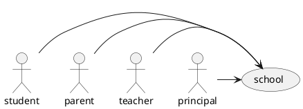
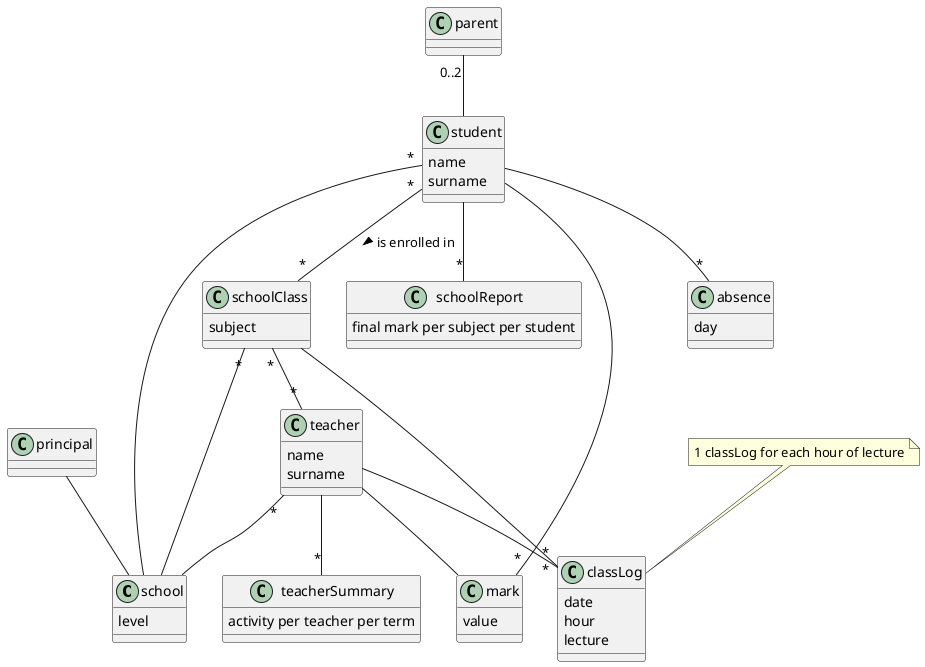
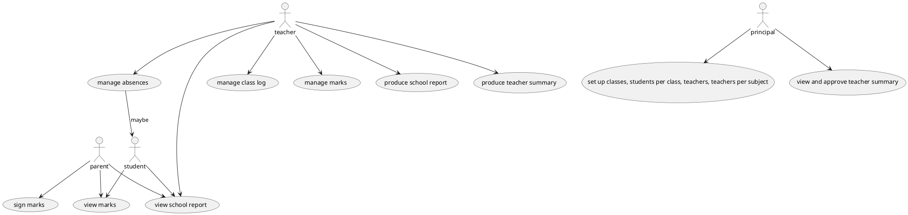

# context diagram

# interfaces

| actor     | physical       | logical |
| --------- | -------------- | ------- |
| student   | PC, smartphone | Web GUI |
| parent    | PC, smartphone | Web GUI |
| teacher   | PC, smartphone | Web GUI |
| principal | PC, smartphone | Web GUI |

# glossary

# UC diagram

# NFR

privacy: school reports and teacher summary are only for the interested person to view.
efficiency: functions must complete in less than 1s
usability: application must be usable by all teachers after 1 hour of training

# Scenario

teacher selects student in schoolClass C, for subject SJ, adds marks