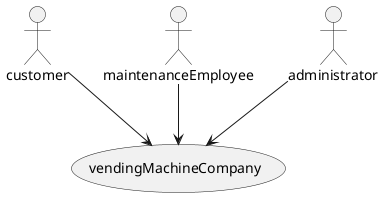
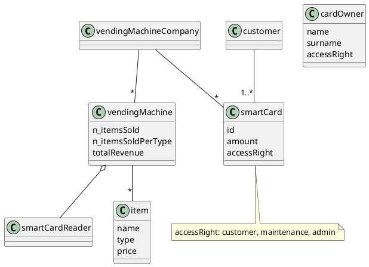
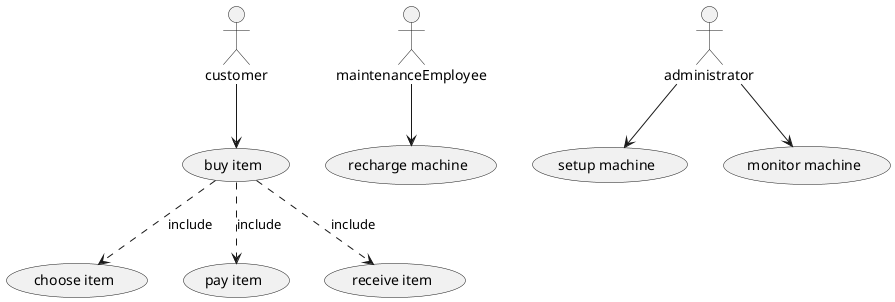

# context diagram

# interfaces

| actor               | physical    | logical   |
| ------------------- | ----------- | --------- |
| customer            | smart card  | GUI       |
| maintenanceEmployee | special key | x         |
| administrator       | special key | admin GUI |

# glossary

# UC diagram

# NFR

privacy: school reports and teacher summary are only for the interested person to view.
efficiency: functions must complete in less than 1s
usability: application must be usable by all teachers after 1 hour of training

# Scenario

sale
precondition: customer has card with enough money to buy item
postcondition: customer gets item, n items sold, n items sold per type, total revenue updated

| step | description                      |
| ---- | -------------------------------- |
| 1    | customer selects item            |
| 2    | customer inserts card            |
| 3    | payment accepted                 |
| 4    | vending machine distributes item |
| 5    |                                  |