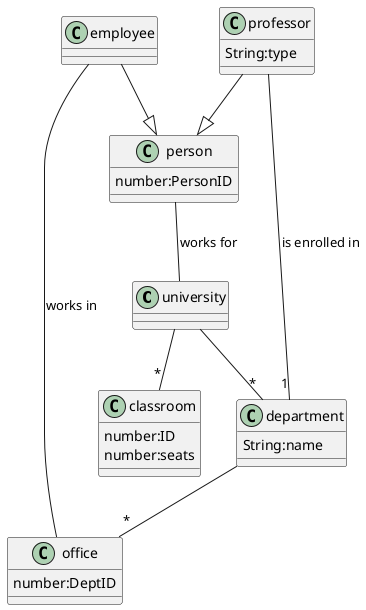

```plantuml
@startuml
class university
class classroom{
    number:ID
    number:seats
}
class office{
    number:DeptID
}
class department{
    String:name
}

university--"*"classroom
university--"*"department
department--"*"office

class person{
    number:PersonID
}
class professor{
    String:type
}
class employee

professor--|>person
employee--|>person

professor--"1"department : is enrolled in
employee--office : works in

person -- university : works for
@enduml
```
